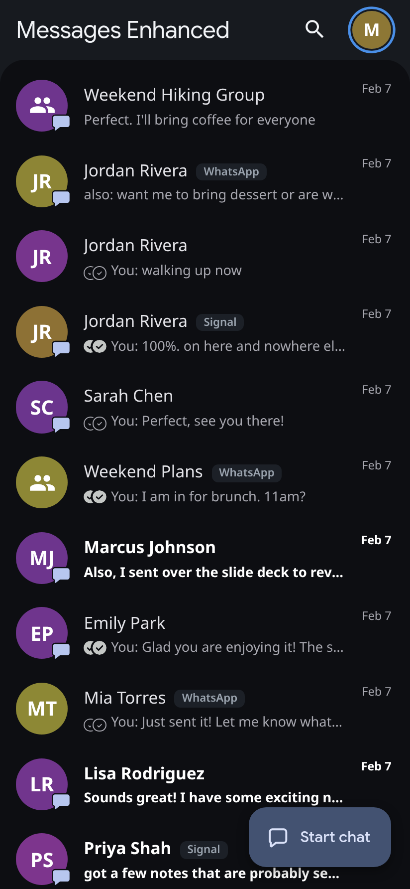
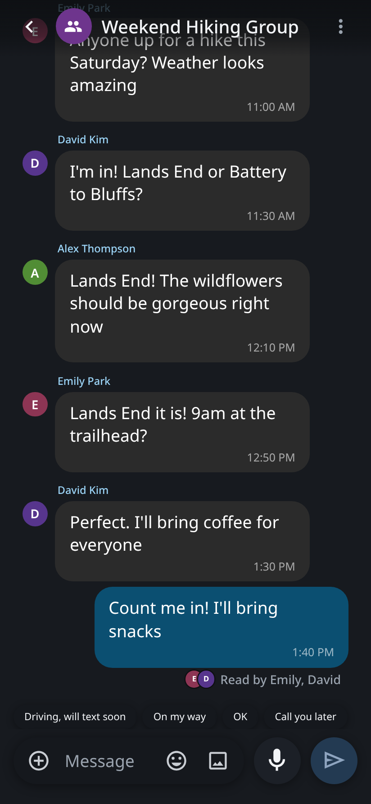
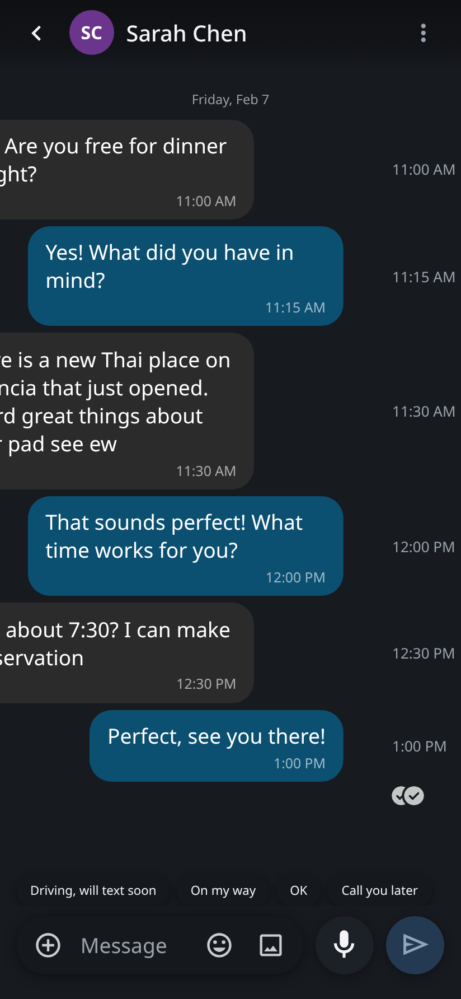
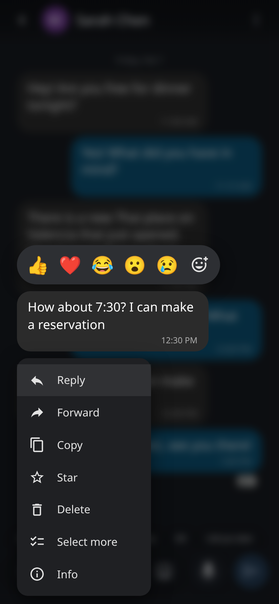
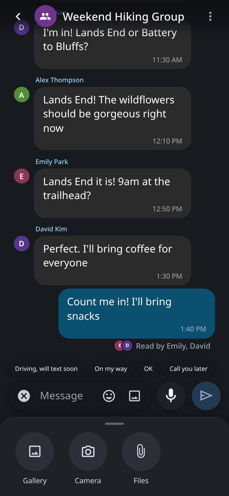
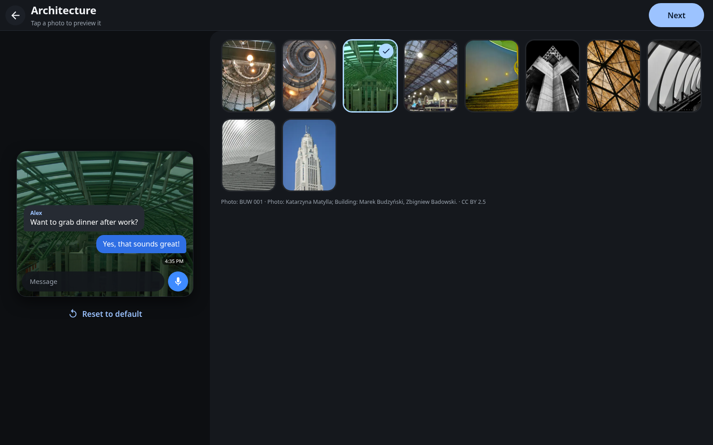
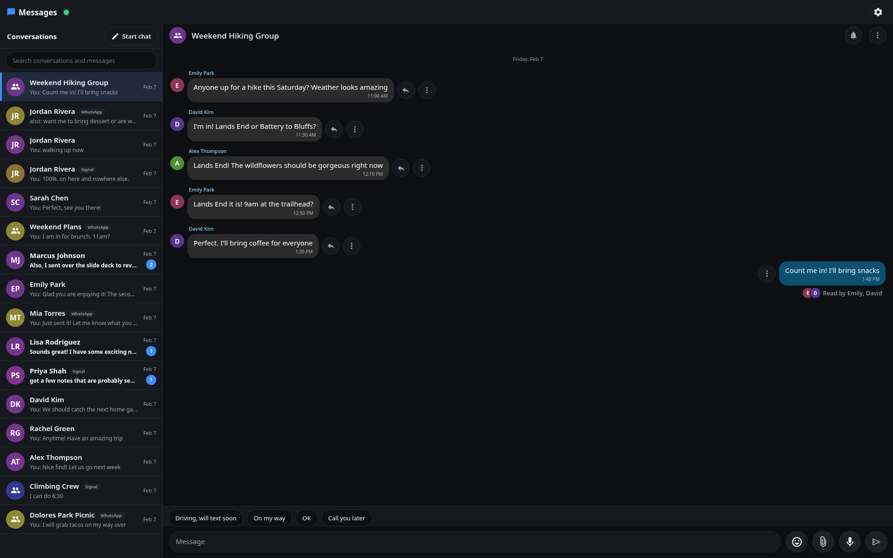
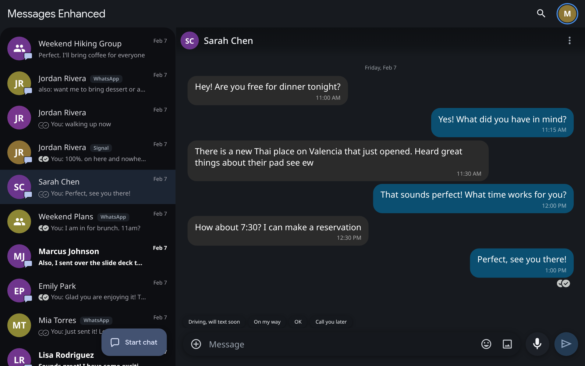

# Messages Enhanced

A self-hosted Google Messages client with a large, touch-friendly UI. The
server runs on your own computer; your phone, tablet, laptop or car browser
connects to it. It has a Car Mode made to work in the Tesla car browser.

It's a fork of [OpenMessage](https://github.com/MaxGhenis/openmessage) by Max
Ghenis, which talks to Google Messages through mautrix-gmessages' `libgm`.
Many thanks to that project, and to the mautrix-gmessages authors.

## Screenshots

All screenshots use the built-in demo data (`serve --demo`); the names and
messages are made up.

| Home screen (phone) | Conversation: "Read by" in a group |
|---|---|
|  |  |
| **Swipe left for times, read-receipt checks** | **Long-press menu** |
|  |  |
| **(+) attachment sheet** | **Chat theme** |
|  |  |

| Car Mode (car screen) |
|---|
|  |

| Tablet / desktop layout (Car Mode off) |
|---|
|  |

## What's here

- **`app/`**: the Go program (server and web app are one binary). The web app
  is at `/app/` and adds:
  - a password-protected page (shared secret, session cookie)
  - large, dark, touch-friendly layout for a car screen
  - voice-to-text (browser speech, with a server speech-to-text fallback)
  - contact photos and Google group icons
  - inline photos with a full-screen viewer, inline videos, link previews
  - replies, delete, read status, typing indicator, start a new chat
  - a pairing screen and a place to paste Google sign-in cookies
  - chat themes: color palettes, 90 freely licensed Wikimedia Commons
    wallpapers in 9 categories (credits in
    [`app/internal/webapp/wallpapers/CREDITS.md`](app/internal/webapp/wallpapers/CREDITS.md)),
    or your own photo; saved on the server so every device sees them
  - pinned conversations: pins from your phone sync read-only from Google,
    and you can add local pins from the car
  - UI zoom (75–175%)
  - Sign out option in Settings
  - Car Mode (a checkbox in Settings, on by default): turn it off for a
    two-pane tablet/desktop layout
  - live typing, emoji picker with bundled Noto Color Emoji, and a
    conversation list that updates live
  - installable app (PWA) with its own icon, on phones, tablets and computers
  - push notifications for new messages, even with the page closed (Web Push;
    not available in the car browser), with an option to hide message text
  - in Car Mode, the message box moves up under the conversation title while
    you type, so the on-screen keyboard can't cover it
  - conversation ⋮ menu: chat theme, group/contact details, pin, archive and
    move to trash (archive and trash sync with Google Messages)
  - notification actions (Reply inline where the browser supports it, and
    Mark as read), a mute bell per conversation, and a Google Messages-style
    composer ("RCS message" / "Text message", SMS label, end-to-end
    encryption lock)
  - paste or drop images, stickers and GIFs (including from Gboard) into the
    message box; they wait as previews with a remove button until you send
  - a Google Messages-style look outside Car Mode: a home screen with large
    round photos, RCS badges, "You:" previews with status checks, pin icons,
    a search button, your Google account photo as the menu button, and a
    floating "Start chat" button plus scroll-to-top; a pill composer with a
    (+) sheet (Gallery, Camera, Files), emoji and gallery buttons, voice
    typing and an always-visible Send button
  - Google Messages-style read receipts: sending / sent / delivered / read /
    failed icons under your latest message (tap a bubble for the time and
    status), and in RCS groups "Read by Alice, Bob" with small photos until
    everyone has read it
  - long-press message menu (reactions, reply, forward, copy, star, delete,
    select more, info); swipe right to reply, swipe left to show times
  - per-message end-to-end encryption locks, health alerts, and the page
    reloads itself after the server is updated
  - Car Mode gets the same bubble colors, grouping, sender names and photos,
    and read-receipt icons, with large touch targets and visible buttons
    instead of gestures
  See [`app/GUIDE.md`](app/GUIDE.md) for details.
- **`extension/`**: "Messages Enhanced Cookie Sender", a small Chrome extension
  that sends your Google Messages sign-in cookies to your own Messages Enhanced
  server in one click. See [`extension/README.md`](extension/README.md).
- **`android/`**: the "Messages Enhanced" Android app. It opens your server's
  web app full screen (Trusted Web Activity, no URL bar) and includes a cookie
  sender. No server is built in: you enter yours on first launch. The server
  serves `/.well-known/assetlinks.json` for the official build automatically;
  set `MESSAGES_ANDROID_CERT_SHA256` if you sign your own. See
  [`android/README.md`](android/README.md).

## Build and run

Requires Go 1.25 or newer.

```bash
cd app
go build -o messages-enhanced .
./messages-enhanced serve --web
```

Then open `http://<host>:<port>/app/` and sign in with your secret.
Keep the server on loopback and put a tunnel or reverse proxy in front of it
if the car needs to reach it over the internet.

Configuration is by environment variable (set your own values; none are
included here):

| Variable | What it's for |
|---|---|
| `OPENMESSAGES_DATA_DIR` | Where the session, database and cookie vault live. |
| `OPENMESSAGES_PORT` | Port to listen on. |
| `OPENMESSAGES_HOST` | Address to listen on. |
| `MESSAGES_SECRET` | Login secret for the web app (turns it on). |
| `MESSAGES_STT_MODE` | Voice-to-text engine choice (browser, server, or auto). |
| `MESSAGES_STT_PROVIDER` | Server speech-to-text provider. |

Variable names from earlier versions are still read as a fallback. More options are documented in [`app/GUIDE.md`](app/GUIDE.md).

## Android app

The app in [`android/`](android/README.md) opens your server's web app full
screen (Trusted Web Activity). Build it with Android Studio or
`./gradlew assembleRelease` (JDK 21).

**Setup:** on first launch, enter your server URL (a bare domain such as
`messages.example.com` or a full `https://` URL). The app checks that it's a
Messages Enhanced server, finds the web app's start URL and saves it; change
it later from the app's "Server" shortcut. Nothing is built in: the default
server address is blank.

**Digital Asset Links:** the server serves `/.well-known/assetlinks.json`
for the official signing key automatically. If you sign your own build (for
example with a self-signed debug or release key), set the server's
`MESSAGES_ANDROID_CERT_SHA256` to your key's SHA-256 fingerprint
(`apksigner verify --print-certs app-release.apk`; several can be given,
comma-separated), and `MESSAGES_ANDROID_PACKAGE` if you change the package
name. Without a match, Android shows a URL bar instead of full screen.

## License

OpenMessage is released under the Unlicense (public domain); see
[`app/LICENSE`](app/LICENSE).
